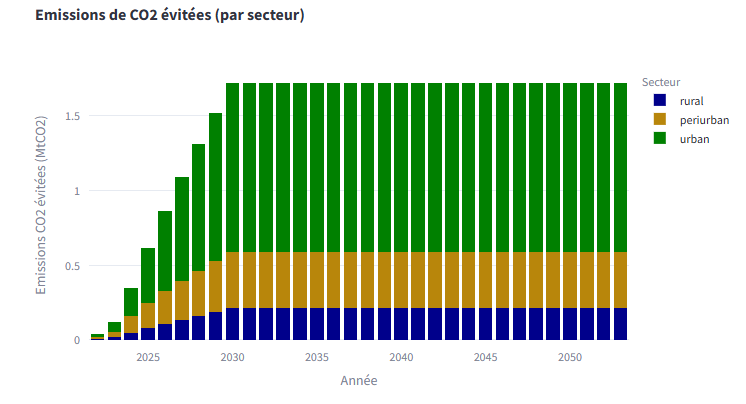
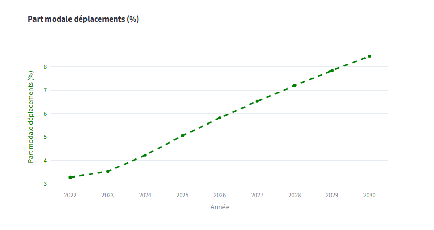

# Methodology 

## Verification of spatial autocorrelation between zones

To determine whether there is a spatial effect between variables, or more commonly called spatial autocorrelation, the usual method is to calculate the Moran index. We can write it as: 

$$ I = \frac{N}{\sum_i\sum_jw_{ij}} \frac{\sum_i\sum_jw_{ij}(X_i - \bar{X})}{\sum_i(X_i-\bar{X})^2} $$

With :
- $N$ : the total number of zones studied;
- $w_{ij}$ : quantification of the influence of $j$ on $i$ according to the chosen rule (detailed below);
- $X$ : The variable studied.

This number must then be compared with its expectation under assumptions of spatial non-correlation (usually a negative value close to 0): 

$$ E(I) = \frac{-1}{N-1} $$

In our case, we have calculated the Moran index in 3 ways: 
- According to the Queen's rule (contiguity of diagonal, row and column zones);
- According to the 2 nearest neighbors;
- According to the 3 nearest neighbors.

In all 3 cases, $I \approx 0.26 >> E(I) \approx -0.001$, so there is indeed spatial autocorrelation on $Y$. We can go further.

## A hybrid model depending on the region 

The NABMOS model combines 3 econometric models for 3 types of territory (excluding the Greater Paris Metropolis, which benefits from a separate model).
The urban and suburban sectors are linear log-log regressions. 
It should be noted that the 95% confidence interval is significant, especially in the peri-urban sector, as the variability of observations is very high. Thus. The trend in the peri-urban and urban sector could be significantly higher than the estimates.
The rural sector is modeled by a regression with spatial lag, which also takes into account the bicycle modal share of neighboring areas to explain the bicycle modal share of the study area. We used this model because conventional econometric models (linear regression, logistic regression, etc.) were unable to adequately predict observations at the rural level. Taking the spatial dimension into account enables us to better appreciate regional dynamics, and to better approximate their trends.

### Urban and peri-urban models: log-log linear regression and ordinary linear regression

The form of the regression for the urban and peri-urban models is as follows

$$ \ln (y) = \alpha + \sum_i \beta_i \ln(x_i) + \varepsilon $$

Where : 
- $y$ : the variable of interest, in this case cycle path length.
- $x$ : the chosen explanatory variables (described in Table 1)
- $\alpha$ : the model calibration constant.
- $\beta$ : the regression coefficients associated with each explanatory variable.
- $\varepsilon$ : the associated error, following a normal distribution $N(0,σ^2)$.

### Rural model: Regression with spatial lag

The rural model is a spatial autoregressive regression model, which takes into account the effect of neighboring modal shares of close neighbors in the study area (in this case, n = 5). 
Thus, the form of the regression is as follows:

$$ y_{it} = \alpha + \rho\sum_{i \neq j} w_{ij} y_{jt} + \beta_{it} x_{it} + \varepsilon_{it} $$

With : 
- $y$ : the variable of interest, in this case linear cycling ;
- $x$ : the chosen explanatory variables (described in Table 1) ;
- $α$ : the model calibration constant;
- $β$ : the regression coefficients associated with each explanatory variable;
- $\varepsilon$ : The associated error, following a normal distribution $N(0,σ^2)$ ;
- $\rho$ : The coefficient modeling the impact of the modal share of neighboring areas on y ; 
- $w$ : The indicator function of the neighboring zone.

Spatial interaction is modeled here through the introduction of the spatially lagged dependent variable $\sum_{i \neq j} w_{ij} y_{jt}$, hence the name “spatial lag”.

In matrix form, we can write:

$$ Y = \rho WY+ X\beta + \varepsilon $$

Where :

- $W$ : The adjacency matrix such that for n adjacent zones of index $(i,j)$ to the zone under study, its coefficients are equal to 1. 

In ordinary linear regression, the vector of predicted values $\hat{y}$ is written as $\hat{y} = X\hat{\beta}$. Here, the right-hand side also depends on $Y$, thus : 

$$ Y = \rho WY+ X\beta + \varepsilon $$

$$ \Leftrightarrow Y -\rho WY = X\beta + \varepsilon $$

$$\Leftrightarrow (I - \rho W)Y = X\beta + \varepsilon$$

$$ \Leftrightarrow Y = (I - \rho W)^{-1}X\beta + (I - \rho W)^{-1}\varepsilon $$
so the predicted variable will be written as : 
$$ \hat{y} = (I - \hat{\rho} W)^{-1}X\hat{\beta }$$

Or, to accelerate the computation , we can also solve the following system using LU decomposition (used here): 

$$ (I - \hat{\rho} W) \hat{y} = X \hat{\beta} $$

A change in my territory also has an impact on my neighbors, which in turn has an impact on me, since spatial econometrics is multidimensional, rather like a time series, which is one-dimensional.

### Paris Model

The Greater Paris model was designed to model travel behavior more precisely within the EPCI “Métropole du Grand Paris” exclusively. 
It is based on Geographically Weighted Regression (GWR), in response to the observation that a regression model covering the whole territory may not adequately capture local variables.
The model consists of ordinary linear regression, with parameters for neighboring areas weighted according to distance from the area of interest (bi-square kernel is used here). For example, observations located 1 km from the study area will be more structuring than those located 10 km from the area of interest. Instead of distance, we have chosen to take the number of neighbors as remoteness metric.
By minimizing the AICc, we estimated that our observation boundary would be equal to 70 neighbors around the zone of interest. 
Thus, the heterogeneity of observations in the zone helps explain the significance of the 4 parameters included in the model (in the table Description of individual behaviors, in the Methodology section).

## Variables of interest for each model

Bicycle modal share is a difficult variable to estimate, due to the diversity of individual behaviors in each territory, as well as access to territorialized data. 

| Explanatory variables | Rural | Suburban | Urban (excluding Paris) | Metropole du Grand Paris |
|-----------------------------------------|-------|------------|---------------------|----------------------------|
| Bicycle roads (km) | X | X | X | X | X
| Motorization rate | X | X | X | |
Population density | X | X | | X | |
| Public transport modal share | | X | |
| 9th income decile | | X | X | |

The variables selected are the result of methodological trade-offs (a priori variable selection by correlation testing, then backward elimination) and internal harmonization to facilitate interpretation of the results. Indeed : 

- For rural and suburban areas, the motorization rate can be interpreted as a proxy for the propensity to use the car. In urban areas, the motorization rate is less relevant, as it is less directly linked to daily car use, due to greater use of public transport for commuting. 
- The data show that the modal share of public transport in urban areas has a negative impact on bicycle modal shift. Its inclusion in the model as an explanatory variable enables us to capture possible modal shifts from the private car to public transport and not to cycling. 
- Population density has a significant influence on the modal share of cycling in rural and peri-urban areas, where there is heterogeneity between EPCIs. In urban areas, population density is generally high and fairly homogeneous between EPCIs, so it doesn't seem to have any explanatory power on trends in bicycle modal share. 
- Finally, taking into account the 9th income decile in the urban sector may help to explain cycling modal share, as affluent populations seem to choose more expensive housing (land) but closer to their workplaces, thus allowing access to cycling infrastructure and at a shorter distance. 

Finally, the discount rate has been increased to 4.5%, but remains a variable parameter in the model. The assumption made for the lifetime of the infrastructure is 30 years, regardless of the area studied.

# Results

## Illustration of model performance (only log-log regression)
The two graphs illustrate the comparison between the actual values in blue and the predictions of the peri-urban model on a logarithmic scale, represented by the bisector, in orange. 

").

In essence, both graphs show satisfactory performance, with a majority of points aligned close to the bisector: 

	R² = 0.51 for the urban model ;
	R² = 0.33 for the suburban model.

This reflects our ability to estimate modal shares well in a large proportion of cases. However, the prediction of extreme values seems more difficult.
In the extreme value ranges, predictions tend to deviate more from actual values. This phenomenon seems to be linked to the scarcity of data in this range. Nevertheless, it can be observed that for large values of cycle path length, predictions remain generally accurate, although a few points show a slight dispersion. 
A notable observation is the greater dispersion of actual values around the bisector, which might suggest that explanatory variables are missing. As the statistical analysis has shown that the other available data are not satisfactory explanatory variables, it would be necessary to collect additional data to test other explanatory variables (e.g. relief).
Some points far from the bisector could also be statistical artefacts (outliers), introducing disproportionate errors into the estimates.

## Illustration of model results

The model can be used to deduce avoided emissions and the total modal share of travel induced by the creation of X kilometers of cycling infrastructure. The graphs are displayed in the “Interactive model” tab, following the chosen parameters. For selected random hypotheses, here are illustrations of the agorithm's outputs:

.

.

For reasons of confidentiality, it will not be possible to illustrate other aspects of the algorithm in greater detail.

